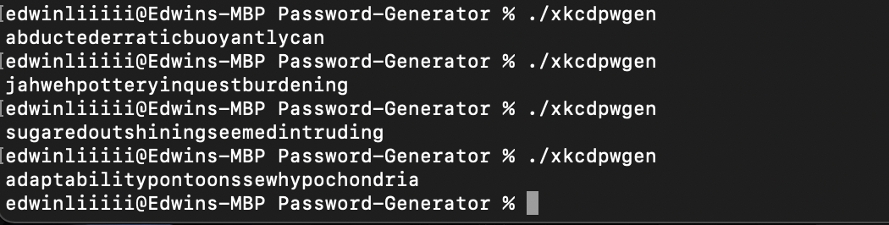
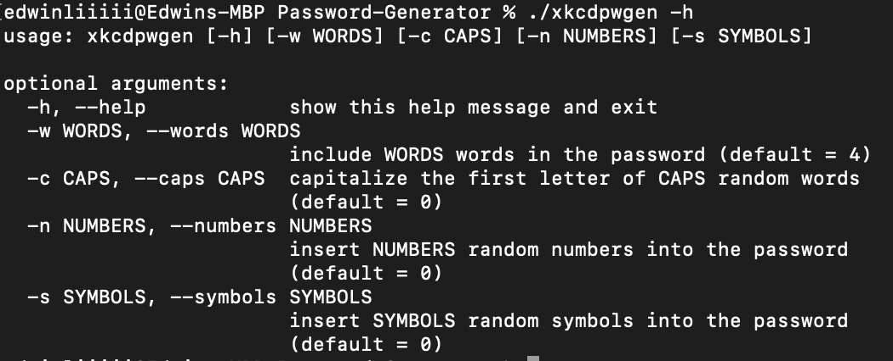

# Password-Generator

a python script that generates random passwords using the english dictionary.

inspired by an xkcd comic.

# Instructions

1. Create a copy of the repo on your local device
2. Navigate to home directory of the repo on your local device
3. Run ./xkcdpwgen for a default password, or ./xkcdpwgen -h for customization menu

